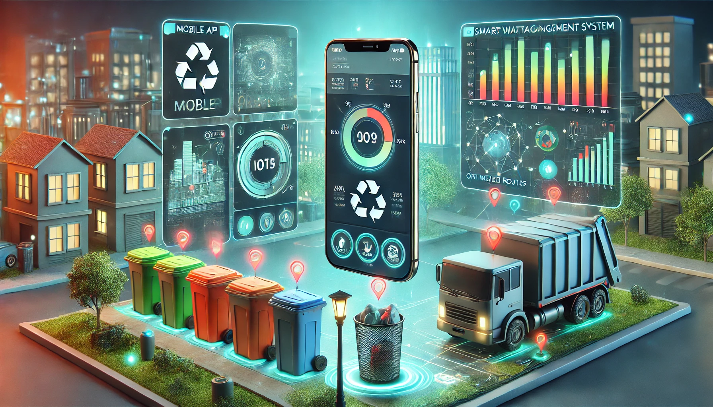

### **The Smart Waste Management App - A Day in the Life of its Users**

---

---

#### **Morning: Residents Start Their Day**

Maria, a resident of Green City, wakes up to a notification on her smartphone. The **Smart Waste Management App** sends her a gentle reminder: "It’s collection day! Please ensure your recyclables are segregated and ready by 9 AM." Maria quickly checks the app, which shows a map of nearby bins and their fill levels.

She notices:

- The **blue recycling bin** on her street is almost full.
- The **green compost bin** at the park is half-empty.

She decides to walk her compost to the park and disposes of her recyclables at the local center recommended by the app. On her way, she scans the QR code on the bins to earn points for responsible waste disposal.

---

#### **Midday: Waste Collection Teams in Action**

John, a municipal worker, begins his shift by logging into the **Admin Dashboard** on his tablet. The dashboard displays:

- A **city map** with IoT-enabled bins, color-coded by their fill levels (red for full, orange for almost full, and green for empty).
- Suggested **optimized collection routes** generated by AI to reduce fuel consumption and time.

John selects Route 2, which focuses on areas where bins are nearly full. His truck is equipped with a GPS connected to the app, helping him follow the route seamlessly.

As he empties each bin, its status updates in real time on the system, thanks to IoT sensors. His truck's weight sensors also sync with the app, tracking the total waste collected.

---

#### **Afternoon: Data Analytics in Action**

At the municipality office, Sarah, a sustainability officer, reviews the system’s **analytics dashboard**:

1. **Waste Segregation Rates**: Charts show an improvement of 15% in recyclable waste segregation compared to the previous month.
2. **Collection Efficiency**: AI-powered analytics reveal that optimizing routes has reduced fuel costs by 20%.
3. **Problematic Areas**: Heatmaps highlight neighborhoods with consistently overfilled bins, prompting a need for awareness campaigns.

Sarah drafts an email campaign through the app's built-in **communication tool**, educating residents about proper waste disposal practices.

---

#### **Evening: App Updates for Residents**

At home, Maria receives another notification:

- “Congratulations! You’ve earned 50 points for responsible waste disposal. Redeem them for discounts at local stores!”

She feels proud of contributing to a cleaner city. Out of curiosity, she checks the app’s **eco-impact tracker**, which shows:

- The amount of waste she has diverted from landfills.
- Her rank compared to other users in her neighborhood.

---

#### **Behind the Scenes: Continuous Improvement**

Meanwhile, the Smart Waste Management System works quietly in the background:

1. **IoT Sensors** on bins continue to monitor fill levels and send real-time data to the backend.
2. The AI system crunches numbers to predict which bins will need attention tomorrow.
3. Developers use cloud-based logs to monitor system performance and deploy updates to enhance app features.

---

#### **Conclusion**

By combining IoT, AI, and user-friendly interfaces, this app transforms waste management into an **efficient, transparent, and community-driven process**. It empowers:

- **Residents** to dispose of waste responsibly and contribute to sustainability.
- **Municipal authorities** to make data-driven decisions and reduce operational costs.
- **The environment** by reducing landfill waste and optimizing recycling efforts.
